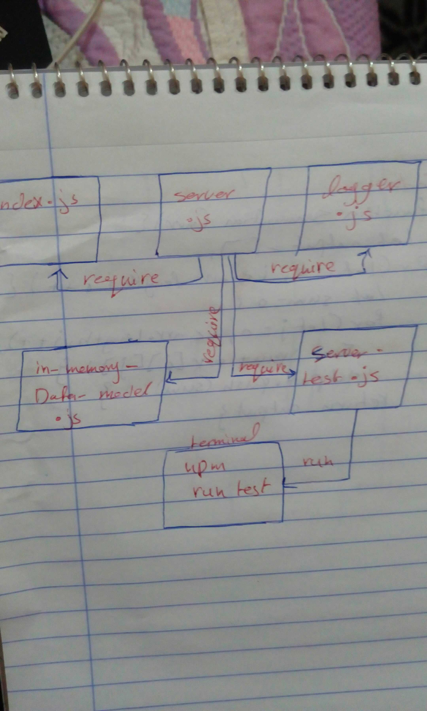

# LAB - Class 07

## Express

### Author: Saja Swalgah

### Links and Resources

- [submission PR](https://github.com/Saja-401-advanced-javascript/lab-07-api-server/pull/1)
- [ci/cd](https://github.com/Saja-401-advanced-javascript/lab-07-api-server/runs/411909261?check_suite_focus=true)

### Setup

- `PORT` - 8080

#### How to initialize/run your application (where applicable)

-  `npm run start`
- `nodemon`

#### Tests

- How do you run tests? npm run test

#### UML

